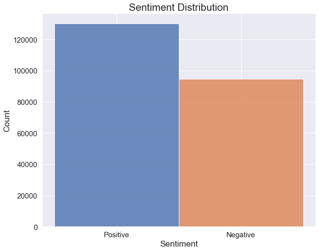
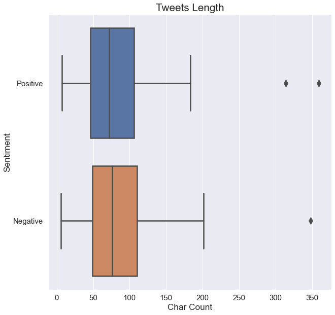
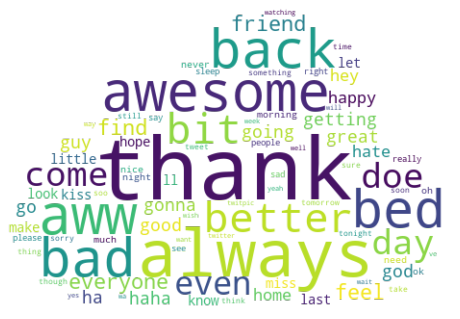

# Twitter Sentiment Analysis Classification - Exploratory Data Analysis

## Libraries


```python
import numpy as np
import pandas as pd

import matplotlib.pyplot as plt
import seaborn as sns

from wordcloud import WordCloud
from PIL import Image

from sklearn.feature_extraction.text import TfidfVectorizer

from preprocessing.text_cleaning import clean_text
from preprocessing.preprocessing import drop_duplicates
from preprocessing.utils import load_dataset, STOPWORDS

import html
```

## Dataset Load


```python
!curl "https://dbdmg.polito.it/dbdmg_web/wp-content/uploads/2021/12/DSL2122_january_dataset.zip" -Lo dataset.zip
!unzip -q dataset.zip; rm dataset.zip; rm -r __MACOSX/
```


```python
tweets = load_dataset()
```

## Data exploration


```python
for col in tweets.columns:
    print(f' {col} has {len(tweets[col].unique())} unique values.')
```

     sentiment has 2 unique values.
     ids has 224716 unique values.
     date has 189779 unique values.
     flag has 1 unique values.
     user has 10647 unique values.
     text has 223106 unique values.


```python
tweets.info()
```

    <class 'pandas.core.frame.DataFrame'>
    RangeIndex: 224994 entries, 0 to 224993
    Data columns (total 6 columns):
     #   Column     Non-Null Count   Dtype 
    ---  ------     --------------   ----- 
     0   sentiment  224994 non-null  int64 
     1   ids        224994 non-null  int64 
     2   date       224994 non-null  object
     3   flag       224994 non-null  object
     4   user       224994 non-null  object
     5   text       224994 non-null  object
    dtypes: int64(2), object(4)
    memory usage: 10.3+ MB


```python
tweets.describe()
```


<div>
<style scoped>
    .dataframe tbody tr th:only-of-type {
        vertical-align: middle;
    }

    .dataframe tbody tr th {
        vertical-align: top;
    }

    .dataframe thead th {
        text-align: right;
    }
</style>
<table border="1" class="dataframe">
  <thead>
    <tr style="text-align: right;">
      <th></th>
      <th>sentiment</th>
      <th>ids</th>
    </tr>
  </thead>
  <tbody>
    <tr>
      <th>count</th>
      <td>224994.000000</td>
      <td>2.249940e+05</td>
    </tr>
    <tr>
      <th>mean</th>
      <td>0.578491</td>
      <td>1.988334e+09</td>
    </tr>
    <tr>
      <th>std</th>
      <td>0.493802</td>
      <td>1.777980e+08</td>
    </tr>
    <tr>
      <th>min</th>
      <td>0.000000</td>
      <td>1.467811e+09</td>
    </tr>
    <tr>
      <th>25%</th>
      <td>0.000000</td>
      <td>1.956965e+09</td>
    </tr>
    <tr>
      <th>50%</th>
      <td>1.000000</td>
      <td>1.996993e+09</td>
    </tr>
    <tr>
      <th>75%</th>
      <td>1.000000</td>
      <td>2.064995e+09</td>
    </tr>
    <tr>
      <th>max</th>
      <td>1.000000</td>
      <td>2.329205e+09</td>
    </tr>
  </tbody>
</table>
</div>


## Graphics


```python
sns.set_theme(style='darkgrid')
```


```python
tweets = load_dataset()
fig, ax = plt.subplots(figsize=(10, 8))

d = {0: "Negative", 1:"Positive"}
sns.histplot(x=tweets["sentiment"].apply(lambda x: d[x]), ax=ax, hue=tweets["sentiment"], legend=None, hue_order=[1, 0], alpha=0.8)

plt.title("Sentiment Distribution", fontdict={"fontsize": "xx-large"})

plt.xlabel("Sentiment", fontdict={"fontsize": "x-large"})
plt.ylabel("Count", fontdict={"fontsize": "x-large"})

plt.xticks(fontsize=15)
plt.yticks(fontsize=15)

#fig.savefig("./report/figures/unbalanced.svg", format='svg')

plt.show()
```


    

    


```python
tweets = load_dataset()
tweets["text"] = tweets["text"].apply(lambda x : html.unescape(x))
tweets['char_count'] = list(map(lambda x: len(x), tweets['text'])) 


fig, ax = plt.subplots(figsize=(10, 10))
d = {0: "Negative", 1:"Positive"}

sns.boxplot(data=tweets, x = "char_count", y = tweets["sentiment"].apply(lambda x: d[x]), orient='h', ax= ax, linewidth=2.5, fliersize=10)


plt.title("Tweets Length", fontdict={"fontsize": "xx-large"})

plt.xlabel("Char Count", fontdict={"fontsize": "x-large"})
plt.ylabel("Sentiment", fontdict={"fontsize": "x-large"})

plt.xticks(fontsize=15)
plt.yticks(fontsize=15)

#fig.savefig("./report/figures/lenghts_distrib.svg", format='svg')

plt.show()
```


    

    


```python
tweets = load_dataset().pipe(drop_duplicates).pipe(clean_text)
fig, ax = plt.subplots(figsize=(8,8))
cloud_mask = np.array(Image.open("./report/figures/cloud.png"))

vectorizer = TfidfVectorizer(strip_accents="ascii", stop_words = STOPWORDS, use_idf=False, min_df=0.01)
vectorizer.fit(tweets["text"])
wc = WordCloud(background_color=None, mode="RGBA", mask=cloud_mask, prefer_horizontal=True, random_state=666)
wc.generate_from_text(" ".join(vectorizer.get_feature_names()))
plt.axis("off")
plt.imshow(wc, interpolation="bilinear")
fig.savefig("./report/figures/word_cloud.png", format='png', transparent=True, dpi=700)
```


    

    

